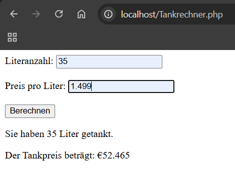

# Tankrechner
 ***
## Informationen zum Bericht:
- **Schuljahr:** 2024/25
- **Name:** Leo Mtetwa
- **Lehrgang:** LG2
- **Klasse:** 3a APC
- **Übungstag:** 20.11.2024
- **Gruppe:** B

***

## Fragen und Antworten
*	**Welche Informationen liefert die Funktion phpinfo();**
<br>
    * PHP-Version: Zeigt die aktuell installierte PHP-Version an.
    * Server-Informationen: Details zum Webserver und  Betriebssystem.
    * PHP-Umgebung: Informationen über die PHP-Umgebung und die geladenen Module.
    * Konfigurationsoptionen: Master- und lokale Werte der PHP-Direktiven.
    * HTTP-Header: Angezeigte HTTP-Header-Informationen.
    * PHP-Lizenz: Informationen zur PHP-Lizenz.
    * Umgebungsvariablen: Details zu den Umgebungsvariablen, die auch in $_ENV verfügbar sind.
    * Vordefinierte Variablen: Alle vordefinierten Variablen aus EGPCS (Environment, GET, POST, Cookie, Server).
  <br>
* **Wozu dienen folgende Optionen in der PHP.INI:**
  <br>
  * **PHP-Fehler ausgeben**: Diese Option gibt an, ob PHP-Fehler direkt im Browser angezeigt werden sollen. 
  <br>
  * **Speichernutzung und die Laufzeit deiner Skripte limitieren**: Setzt das maximale Speicherlimit, das ein Skript verwenden darf. Legt die maximale Ausführungszeit eines Skripts in Sekunden fest. Dies verhindert, dass Skripte zu lange laufen und den Server blockieren.
  <br>
  * **allow_url_fopen = off**: Diese Option aktiviert oder deaktiviert die Fähigkeit von PHP, Dateien über URL-Wrapper wie HTTP oder FTP zu öffnen. Wenn allow_url_fopen auf off gesetzt ist, können keine externen Dateien über URLs geöffnet werden, was ein Sicherheitsrisiko minimiert. 
  <br>
  * **safe-mode = on**:  Diese Option war eine Sicherheitsfunktion, die bestimmte PHP-Funktionen einschränkte, um potenzielle Sicherheitslücken zu schließen. Sie wurde jedoch in PHP 5.4.0 entfernt und sollte nicht mehr verwendet werden.
  <br>
  * **session.auto_start = off**: Diese Option gibt an, ob PHP automatisch eine Sitzung startet, wenn ein Skript ausgeführt wird. Wenn session.auto_start auf off gesetzt ist, muss die Sitzung manuell mit session_start() gestartet werden

***

Beispiel für Variablen in PHP:
```PHP
<?php
$erste_variable = 1;
echo("Der Wert unserer Variablen ist $erste_variable. ");
$erste_variable = 2;
echo("Nun ist der Wert $erste_variable");
// Die Ausgabe lautet: Der Wert unserer Variablen ist 1. Nun ist der Wert 2
?>
```

***

##### Programmiersprache:
*PHP*

## Vorgabe der Progammieraufgabe
Die Aufgabe dieses Programms ist die Addition und Multiplikation mehrerer Zahlen und Anzeige des Rechenergebnisses. (KEINE INTERAKTION MIT BENUTZER – Die Werte stehen in der PHP Datei fix eingetragen)
Zwei Tankfüllungen (liter1=40.5, liter2=35.7) mit dem gleichen Literpreis (preis=1.499) sind zu multiplizieren und als Kosten (kosten) in einem Aussagesatz anzuzeigen.
Dafür wird im 1. Teil die Kostenermittlung durchgeführt.
Im 2. Teil wird bei der Ergebnisanzeige eine Zeichenkette durch Verbindung aus: Der Zeichenkette "Die Benzinkosten betragen für ", der Addition der Variablen liter1 + liter2, der Zeichenkette "Liter ", der Variablen kosten und der Zeichenkette "€" gebildet.
Das Ergebnis sollte dann so aussehen:
Die Benzinkosten betragen für 76.2 Liter 114.2238 €

ERWEITERUNG: Dateneingabemöglichkeiten recherchieren (POST/GET Variablen mittels HTML Formularen)


### Umsetzung des Projekts:
Ich habe eine PHP Datei gemacht, mit HTML und PHP Code.
Zuerst ist eine Form zum ausfüllen der Werte die man berechnen möchte. 
Die Berechnung selbst findet dann im PHP Code statt, welcher dann die Werte aus der Form nimmt und diese dann zusammenrechnet und ausgibt. Die Werte werden aber nicht gespeichert. 


### Code Blöcke:
Ich benutze eine Form um die Textfelder zu machen und um eine Post Methode zu benutzen.
```HTML
 <form method="post" action="">
        <label for="liter">Literanzahl:</label>
        <input type="text" id="liter" name="liter"><br><br>
        
        <label for="preis">Preis pro Liter:</label>
        <input type="text" id="preis" name="preis"><br><br>
        
        <input type="submit" name="berechnen" value="Berechnen">
    </form>
```

Um den Preis auszurechnen, habe ich dann diesen Code hier benutzt.
```PHP
<?php
    if (isset($_POST['berechnen'])) {
        $liter = $_POST['liter'];
        $preisProLiter = $_POST['preis'];
        $gesamtPreis = $liter * $preisProLiter;
        echo "<p>Sie haben $liter Liter getankt.</p>";
        echo "<p>Der Tankpreis beträgt: €" . $gesamtPreis . "</p>";  
    }
    ?>
```
***

### Bilder von Resultaten:
)
